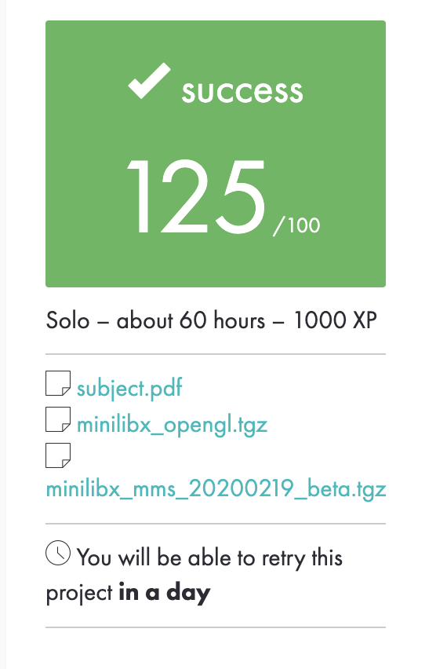
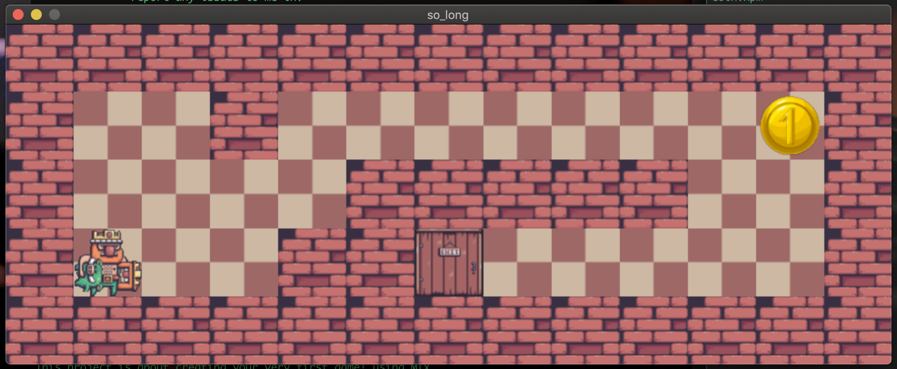
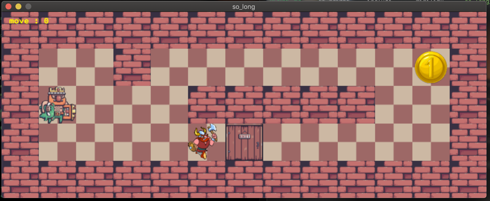

<!-- <a href="https://github.com/YOPll/get_next_line"> -->
  
</a>
   
  125/100

# Introduction to so_long
So_long is an individual project at [1337](1337.ma) *#42network* that requires us to create a small 2D game with minilibx. You'll learn about textures, sprites and tiles.

### Description
This project is about creating your very first game! using Mlx.

[SUBJECT](./Subject/en.subject.pdf)

# How to play ?
- You need to compile  source files with `make ` for mandatory part and `make bonus` for bonus part.
- To launch the game, execute `./so_long` with a map as argument: \
`./so_long maps/*.ber`
U free to make your own map ;).

# PREVIEW

   

